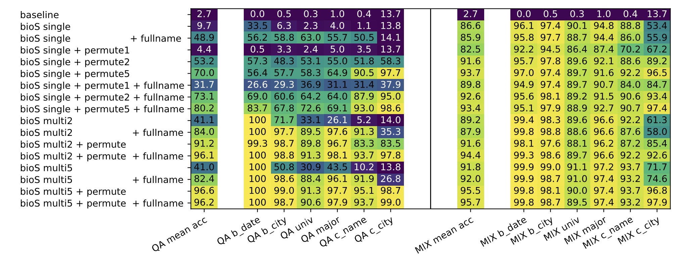

# PhysicsLLM 3.1 — Independent Replication

An independent reimplementation of **"Physics of Language Models: Part 3.1, Knowledge Storage and Extraction"** (Allen-Zhu & Li, 2023). No official code was published by the authors.

> **Note:** This is not the authors' code. It is an independent replication. All implementation decisions are our own.

---


*P_test exact-match accuracy on bioS multi5+permute+fullname. Our replication (97.5%).*

---

## Results

| Metric | Paper | This repo |
|--------|-------|-----------|
| P_test — multi5+permute+fullname (exact match) | ~96.2% | **97.5%** |
| P_train — multi5+permute+fullname (first token) | ~97.0% | **100.0%** |
| P_test — single | ~9.7% | ~9% |

---

## Bugs Found During Replication

Getting from ~7% to 97.5% required finding and fixing bugs that are easy to introduce and hard to diagnose. Documenting them here for anyone attempting their own replication.

###  Pretrain data was not shuffled

**What happened:** `generate_bios.py` produced bios grouped by person: all 5 paraphrases of person 0, then all 5 of person 1, etc. `tokenize_bios.py` concatenated them in that order. The dataloader read sequential 512-token windows with no shuffling.

Each bio is ~90 tokens, so ~5.7 bios fit in one 512-token window. A single training window contained all 5 paraphrases of the same person. The model could cross-attend between paraphrases within the same context window instead of storing facts on the name embedding.

**Result:** Perfect train loss (~0.013) but near-zero QA extraction (P_test ~7%). Knowledge was stored in a non-extractable form, exactly the failure mode Allen-Zhu & Li describe for `bioS single`, but caused by a data pipeline bug rather than augmentation design.

**Fix:** `random.shuffle(texts)` before writing the dataset. After regenerating and re-pretraining: P_test jumped from 7% to ~97%.


---

## Setup

```bash
git clone https://github.com/ykrmm/PhysicsLLM_3.1
cd PhysicsLLM_3.1
pip install -r requirements.txt
```

**Requirements:** Python 3.10+, PyTorch 2.8.0, HuggingFace Transformers, numpy. 

I used 4xH100 for pretraining ~12 hours for multi5p and less than 2 hours for single.

---

## Reproducing the Main Result

The full pipeline runs in three steps and are provided in `scripts/`.

### Step 1 — Generate data

```bash
bash scripts/generate_data.sh
```

Generates `bios_multi5p_fullname.npy` (~37M tokens, shuffled). Produces 100K synthetic individuals with 6 attributes (birth_date, birth_city, university, major, company, company_city), 5 paraphrased biographies per person, sentence order shuffled, full name used in every sentence.

### Step 2 — Pretrain

```bash
bash scripts/pretrain_multi5p_fullname.sh
```

Trains GPT2-small (124M params, rotary PE) from scratch on the generated data. ~400K steps, cosine LR schedule decaying to 10%, batch size 192, context window 512 tokens. Expected final loss: ~0.013.

### Step 3 — LoRA QA finetune + eval

```bash
bash scripts/finetune_multi5p_fullname.sh
```

LoRA finetune on QA pairs for P_train individuals (50K), evaluate on P_test (50K). LoRA config: r_qv=8, r_emb=128, cosine LR to 10%, 50K steps, batch 48. Expected P_test: ~97%.


## Model & Data Details

**Model:** GPT2-small architecture (12 layers, 12 attention heads, 768 hidden dimensions) with rotary positional embeddings (NeoX-style). ~124M parameters.

**Data:** 100K synthetic individuals, sampled from fixed attribute pools:
- Names: 400 first × 400 middle × 1000 last names
- Dates: 200 × 12 × 28 combinations
- Cities: 200 birth cities
- Universities: 300 universities, 100 majors
- Companies: 263 companies (company_city is deterministic)

**Augmentation (multi5+permute+fullname):** 5 paraphrased biographies per person, sentence order shuffled across paraphrases, full name used in every sentence instead of pronouns.

**QA finetuning:** LoRA on query/value attention matrices (r=16) + embedding layer (r=128). 50K QA pairs from P_train individuals, tested OOD on P_test individuals.

---

## Citation

If you use this code, please cite the original paper:

```bibtex
@article{allen2023physics,
  title={Physics of language models: Part 3.1, knowledge storage and extraction},
  author={Allen-Zhu, Zeyuan and Li, Yuanzhi},
  journal={arXiv preprint arXiv:2309.14316},
  year={2023}
}
```

---

## Notes

This replication was carried out as part of ongoing research on graph-structured knowledge injection in language models. The debugging history documenting the two bugs above is preserved in full in `logs/qa_finetune_gap_diagnosis.md`.

Compute: H100 GPUs (Jean Zay, IDRIS, France).
